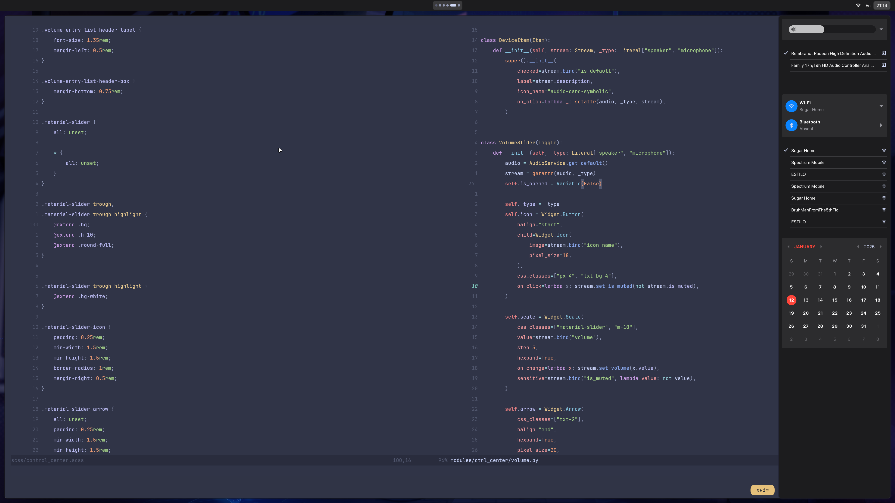

# NixBox

Blazing fast, minimal, working WM environment for NixOS.

> [!WARNING]
> Still in alpha, expecting bugs

## Screenshot



## Features

- Out of box working environment with NixOS.
- User directory manager by [Home manager](https://nix-community.github.io/home-manager/options.xhtml)
- Wayland window manager by [Hyprland](https://wiki.hyprland.org/)
- Status bar and widgets by [Ignis](https://linkfrg.github.io/ignis/stable/index.html)
- Neovim setup by [Nixvim](https://nix-community.github.io/nixvim/)
- Theme with 4 flavors by [Catppuccin](https://catppuccin.com/)
- All of them are modular and can be enabled/disabled, or partially overriden in your config file. 


## Install

Clone the repo, create a config directory for nix and copy the content of the example to it
```sh
git clone git@github.com:AstrickHarren/nixbox.git
mkdir -p ~/.config/nix
cp nixbox/example/* ~/.config/nix
```

Copy the your NixOS hardware configuration to the config directory as well, it can be done usually by
```sh
cp /etc/nixos/hardware-configuration.nix hardware.nix
```

> [!IMPORTANT]
> Make sure you read the example thoroughly and change config accordingly before the next step!
> There are plently of places you might want to change, most obviously the userName and hostName

## Build

Now you are good to go! Run the following commands to build your NixOS and home manager!

```sh
sudo nixos-rebuild switch --flake ~/.config/nix 
home-manager switch --flake ~/.config/nix
```

## Update

If there is a change made to NixBox, you can update your subscription by running
```sh
nix flake update nixbox
```
under `~/.config/nix`. This will update you to the newest version of NixBox and any 
dependency of NixBox. Rebuild your NixOS and/or home manager and you'll see the effect.
